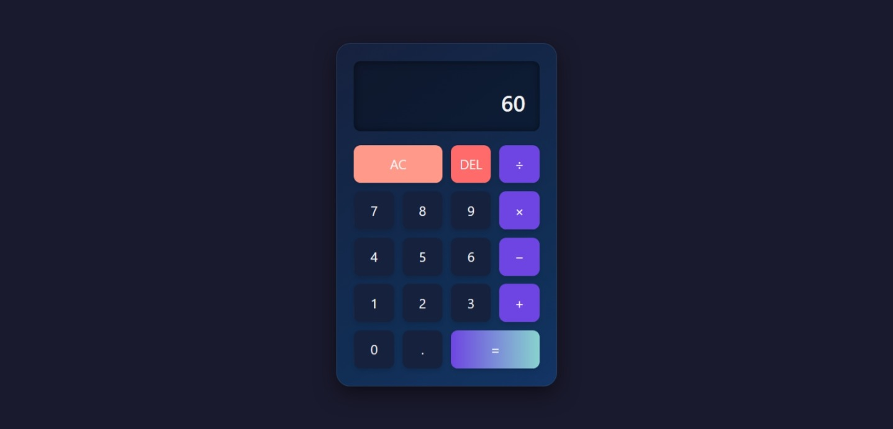

# 🧮 Basic Calculator (Dark Mode Edition)

A sleek, interactive calculator built using **HTML**, **CSS (Grid + Effects)**, and **JavaScript**. Designed with a visually attractive **dark theme**, this calculator handles all basic arithmetic operations with responsive layout and smooth animations.

---

## 🎯 Features

- ✨ Clean, modern **dark-themed UI**
- 🎨 Stylish color palette with glowing button effects
- 🎯 Performs **Addition, Subtraction, Multiplication, Division**
- 🎛️ Built with **CSS Grid** for perfect button alignment
- 🖱️ **Interactive UI** with click animations
- 🧠 Smart input handling with JavaScript logic (if-else, operators, loops)

---

## 📸 Preview

---

## 🛠️ Tech Stack

- **HTML** – Structure of the calculator interface
- **CSS** – Dark mode theme, responsive layout, hover/click effects
- **JavaScript** – Event handling, arithmetic operations, input logic

---

## 📂 Project Structure
calculator/
├── index.html
├── style.css
├── script.js
└── assets/
└── calculator-dark.png

---

## 🎨 Dark Theme Color Palette

| Element         | Color Code    |
|-----------------|---------------|
| Background      | `#1e1e2f`     |
| Buttons         | `#27293d`     |
| Button Hover    | `#3e4260`     |
| Text/Numbers    | `#ffffff`     |
| Accent (Active) | `#00ffe7`     |

## 🚀 How to Run

1. Clone the repo or download the ZIP
2. Open `index.html` in your browser
3. Start clicking and calculating!

---

## 💡 Future Enhancements

- ⌨️ Keyboard input support  
- 🧾 Calculation history  
- 🧮 Scientific functions (%, √, etc.)

---

## 🤝 Connect with Me

🔗 [LinkedIn](https://www.linkedin.com/in/namira-qureshi-28a45a282)  
📧 namiraq336@gmail.com 

---

> Designed with 💙 by Namira

